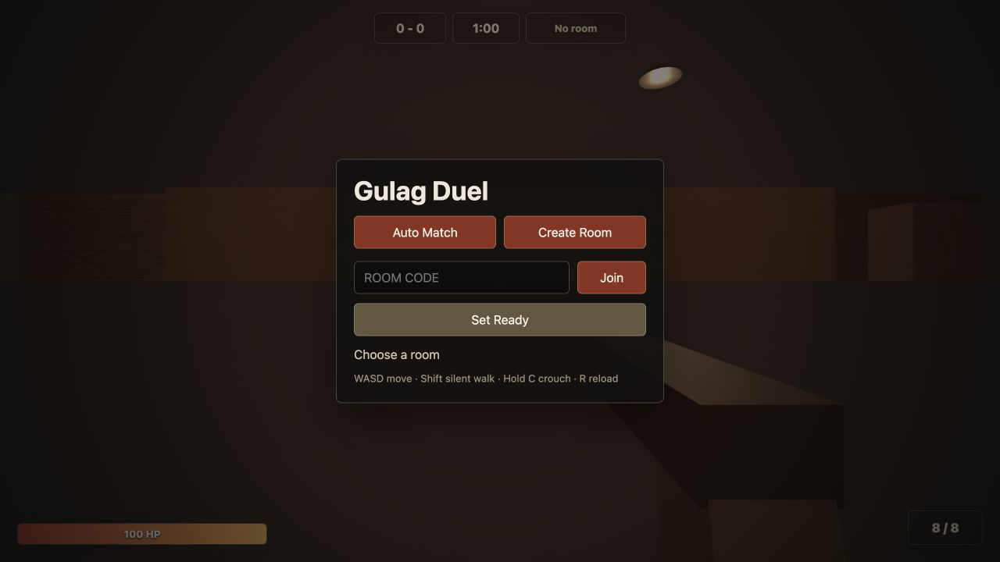
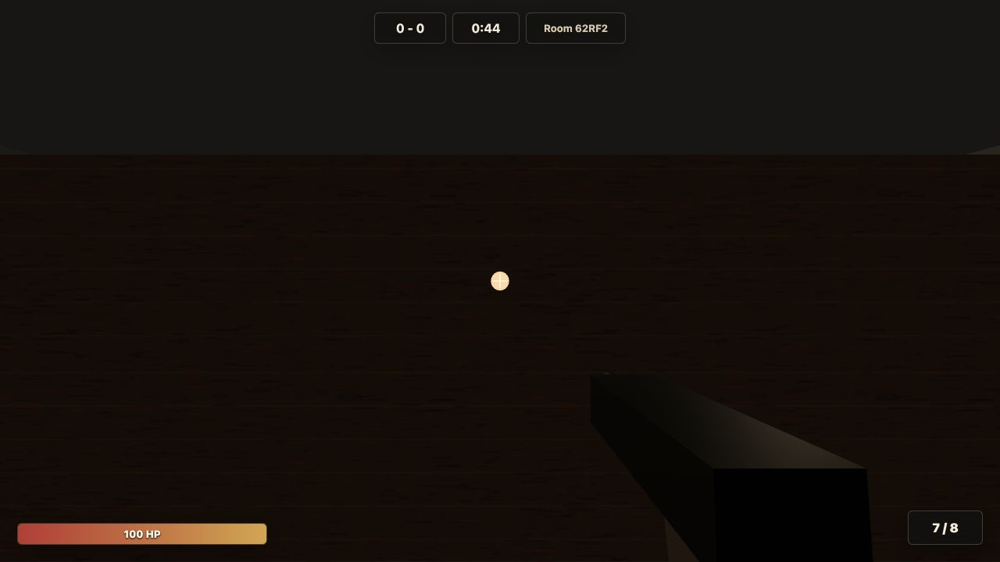

# Gulag Duel

Browser-based 1v1 FPS duel inspired by the Warzone Gulag format.

Players can create a private room, automatically copy its five-character code, and share it with one opponent.



## Play Online

Development preview: **[gulag-fps.onrender.com](https://gulag-fps.onrender.com)**

Create a room and share the five-character code with one friend. The current Render instance can take close to a minute to wake after being idle. If the first load does not respond immediately, leave the tab open and try again shortly.

Once both players are ready, the game moves directly into the first-person arena.



This is a development deployment for small two-player tests. Active rooms live in one server process and are not persisted across restarts or deployments.

## Game Rules

- Best of 5 rounds; the first player to win 3 rounds wins the match.
- Each room supports exactly 2 players.
- Each round lasts 1 minute.
- If time expires, the same round restarts without awarding a point.
- Both players spawn with one pistol: 8-round magazine, 420 ms fire cooldown, and 1.6-second reload.
- Health resets to 100 HP at the start of every round.
- Headshot: instant kill. Torso: 50 damage. Limbs: 25 damage.

## Controls


| Input      | Action      |
| ---------- | ----------- |
| `WASD`     | Move        |
| Mouse      | Look        |
| Left click | Fire        |
| `R`        | Reload      |
| `Space`    | Jump        |
| `Shift`    | Silent walk |
| Hold `C`   | Crouch      |


Audio starts after the first click or key press because browsers block autoplay. Lobby music stops when the match begins. Local footsteps and gunshots remain audible; an opponent's gunshot uses positional audio.

## Technology

- Three.js and WebGL for the arena, player models, weapon, lighting, and effects
- Express for the web server
- Socket.IO for rooms and real-time multiplayer events
- Server-authoritative hit registration, health, ammo, timer, and round state
- Client prediction with server reconciliation for responsive movement
- Custom collision logic shared by the browser and server
- Node.js test runner for unit and WebSocket integration tests
- Docker for repeatable local and hosted builds

## Architecture

```text
Browser client
├── Game                 scene loop and system coordination
├── PlayerController     input, prediction, movement, and collision
├── Pistol               local weapon feedback and tracers
├── NetworkClient        ordered Socket.IO events and sequence numbers
└── HUD / Audio          match information and sound playback
          │
          │ WebSocket
          ▼
Node.js server
├── GameServer           socket connections and event routing
├── MatchManager         rooms, rounds, health, ammo, and timers
├── Hitboxes             head, torso, arm, and leg ray intersections
└── Shared config        arena, cover, spawn, weapon, and damage rules
```

The browser predicts its own movement immediately so controls do not wait for a network round trip. Movement updates carry increasing sequence numbers. Ordinary movement and periodic snapshots are volatile, allowing an old snapshot to be dropped instead of building a stale network queue.

```js
const seq = ++this.seq;
const transport = force ? this.socket : this.socket.volatile;
transport.emit("player:update", { ...snapshot, seq });
```

The server checks movement speed, arena bounds, and cover collisions. Rejected updates return the last authoritative position. The client matches that correction to its saved prediction and preserves any valid movement produced afterward.

```js
const acceptedMove = attemptedStep <= maxStep
  && !isPositionBlocked(position)
  && !isMovementBlocked(player.position, position);

if (acceptedMove) player.position = position;
return { accepted: acceptedMove, state: movementState(player) };
```

Firing is authoritative. Before a shot, the client reliably sends its latest pose. The server enforces fire rate and ammo, reconstructs the ray from the confirmed position and aim, checks cover before player hitboxes, applies damage, and broadcasts one result to both players.

```js
const origin = {
  ...shooter.position,
  y: shooter.position.y + (
    shooter.crouch
      ? GAME_CONFIG.player.crouchEyeHeight
      : GAME_CONFIG.player.eyeHeight
  )
};
const direction = directionFromAngles(shooter.yaw, shooter.pitch);
const hit = intersectPlayerHitboxes(origin, direction, target);
```

## Local Development

Requirements: Node.js 20 or newer.

```bash
npm install
npm run dev
```

Open [http://localhost:3000](http://localhost:3000) in two browser windows. Create a room in one window, join with the copied room code in the second, and set both players ready.

## Quality Checks

```bash
npm run qa
```

The QA command runs syntax validation, unit tests, real two-client Socket.IO integration tests, and a production Vite build. Coverage includes collision blocking, movement rejection and reconciliation, synchronized movement streams, hitbox damage, weapon limits, round transitions, and room-code validation.

## Docker

```bash
docker build -t gulag-duel .
docker run --rm -p 3000:3000 gulag-duel
```

The image builds the Vite client and runs the Express and Socket.IO server on port `3000`.

## Deployment

The current development build is hosted as one Render web service. A single Node.js process serves the client and owns all active game rooms, which is simple and cost-effective for testing with one friend.

Render deploys the repository using the included `Dockerfile`. WebSockets use the same public service URL, so no separate frontend host or socket endpoint is required.

Current limitations:

- The development instance may cold-start after being idle.
- Rooms disappear whenever the process restarts or a new version deploys.
- The server is designed for one running instance; room state is stored in memory.
- This deployment is intended for small tests, not unrestricted public traffic.

## Future Production Scope

Azure remains a future option when the game is ready for multiple concurrent rooms and stronger availability. The repository keeps the existing Container Apps configuration under `azure/` for that phase.

Before scaling to multiple containers, room ownership must move beyond one process. A production architecture would add a shared room directory or match coordinator, Redis-backed state/pub-sub, reconnect handling, monitoring, rate limiting, and regional routing. Azure Container Apps with Azure Cache for Redis or Azure Web PubSub would then be a practical direction; AKS would add unnecessary operational cost at the current scale.

The preferred production model is still many isolated 1v1 rooms per backend process, not one container per match. It uses compute more efficiently and avoids scheduling, routing, and cleaning up a separate container for every short duel.
